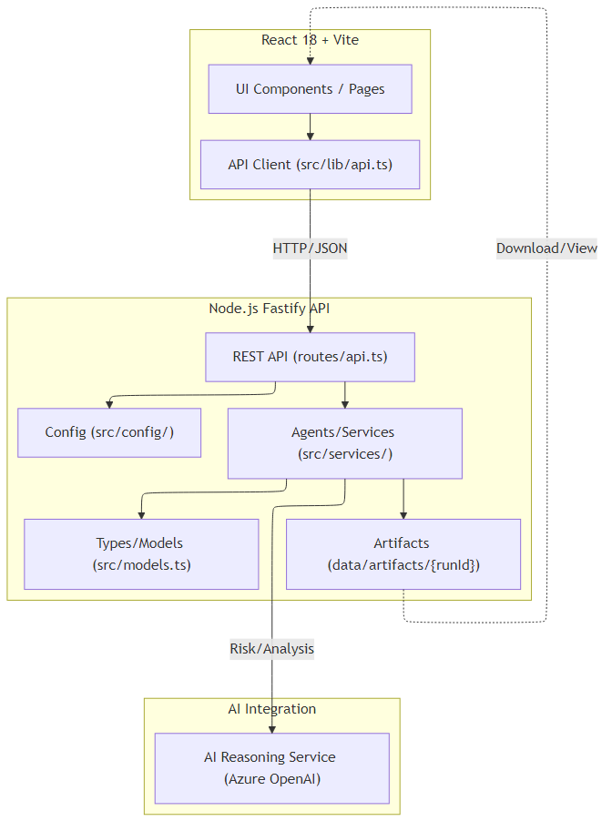
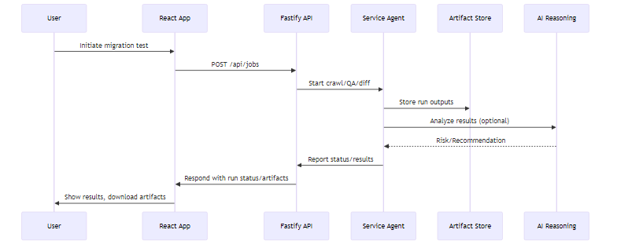
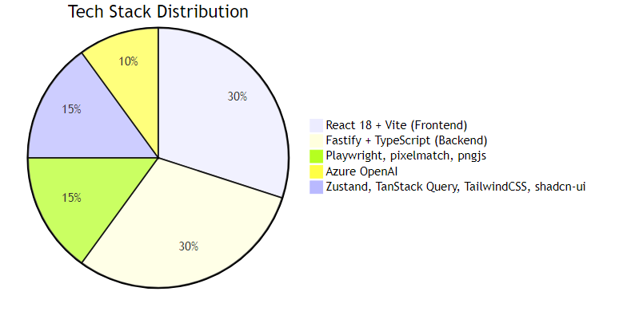

# 🛡️ Migrate Guard – Secure, Automated Website Migration Testing Suite 🚀

> **Supercharge your website migrations:** Spot regressions, catch visual issues, track data and functional differences, and deliver *risk-free* launches—all from one unified platform!

---

<div align="center">
  
  
  
  
  
</div>

---

> 👉 **New here?** Start with the [Developer Onboarding Guide](./DEVELOPERS.md) for setup, API usage, automation, best practices, and everything you need to be productive quickly!

## ✨ What is Migrate Guard?

**Migrate Guard** is an all-in-one automated website migration testing toolkit. It lets engineering/product/QA teams run side-by-side production/candidate comparisons and generate human-friendly reports for Go/No-Go launches and retro analysis.

- **Visual regressions:** Detect pixel diffs, layout shifts, and subtle UI changes
- **Functional QA:** Broken link detection, navigation & forms, JS errors, HAR analysis
- **Data validation:** Compare DOM/text, tables, JSON APIs, and key field mappings
- **AI-powered executive risk analysis:** Severity, risk scores, recommendations (Azure OpenAI!)
- **Super-powered dev workflow:** Snapshots, artifact management, and integrated REST API


## 🗂️ Project Structure

```txt
migrate-guard/
├── backend/          # Node.js Fastify + TypeScript API
│   ├── src/
│   │   ├── routes/   # API routes
│   │   ├── services/ # Comparison, diff, agent, QA, reasoning
│   │   ├── models/   # Strongly typed data models
│   │   └── config/   # Backend config
│   └── data/         # Persisted jobs, runs, artifacts
│   └── README.md     # Backend how-to
├── src/              # React 18 Frontend
│   ├── components/   # UI primitives & dashboard
│   ├── pages/        # Page views
│   ├── lib/          # Types, store, API, utils
│   └── hooks/        # Custom hooks
├── API.md            # Full backend OpenAPI
├── DEVELOPERS.md     # Developer onboarding & conventions
├── README.md         # 👈 You are here!
```


## ⚙️ Tech Stack

**Frontend:** React 18 + Vite + TypeScript · Zustand · TanStack Query · TailwindCSS · shadcn-ui

**Backend:** Fastify · TypeScript · Playwright · pixelmatch · pngjs · Azure OpenAI · File/JSON Storage

## 🎛️ Core Features

- 🤝 **Dual-site diffing**: Compare baseline vs. candidate (prod vs. migration)
- 🖼️ **Visual diffs**: Screenshot, pixel & layout analysis (heatmaps, metrics)
- 🧑‍💻 **Functional QA**: Crawls, forms, broken links, JS errors, HARs
- 📜 **Data Integrity**: Tables, text, APIs—fieldwise diffing
- 🤖 **AI Reasoning**: Severity classification, risk scores, recommendations (Azure/GPT-4)
- 📊 **Automated Reports**: Executive & technical summary, Go/No-Go
- 🗄️ **Artifact Management**: All results, logs, screenshots available for download


--

## 🏗️ API Overview  
Full REST API Docs ➡️ [backend/API.md](./backend/API.md)

**Key Endpoints:**
- `POST /api/jobs` - Create a comparison job
- `POST /api/jobs/:id/run` - Trigger a run
- `GET /api/runs/:id/artifacts` - Fetch run artifacts
- `POST /api/jobs/migrate` - Migrate legacy jobs

Supports:
- 🕸️ Crawl settings: depth, include/exclude
- 🗂️ Page mapping
- 🌐 Test matrix: visual, functional, data, SEO


## 👨‍💻 Quickstart

**Frontend:**
```sh
npm install      # in root
yarn dev         # or npm run dev
# Open http://localhost:8080
```
**Backend:**
```sh
cd backend
npm install
# Install browsers for Playwright crawl agent
npx playwright install chromium
npm run dev      # API at http://localhost:4000/api
```

See [backend/README.md](./backend/README.md) for full setup & CLI options.


## 🧩 Architecture Highlights

### Agents & Services
- **CrawlAgent**: Dual-site crawler, sitemap support, page matcher
- **PlaywrightExecutionService**: Browser/DOM/screenshot/console collector
- **VisualDiffService**: Pixel, layout, and heatmap insight
- **FunctionalQaAgent**: Navigation, forms, links, JS errors, HAR capture
- **DataIntegrityAgent**: Table/text/API comparison, similarity scoring
- **AiReasoningService**: Uses Azure OpenAI for intelligent artifact analysis
- **ReportAgent**: Executive reports, markdown & JSON, Go/No-Go

### Artifact Pipeline
- All artifacts (screenshots, HAR, logs, reports) organized per run in `/backend/data/artifacts/{runId}`
- Executive and technical Markdown reports generated for each run

### Config & Extensibility
- JSON files for jobs/runs -> Plug in DB or cloud storage later
- TODOs in code for Playwright MCP, Crawl4AI, further AI & agent orchestration


---

## 🏁 Phase 2 Roadmap – Comparison Agents & Intelligence

### 📋 What's Next (Work Estimation & Cost Analysis)

**Full Phase 2 Scope:** 10–14 days dev work · $50–270/month infrastructure (optional) · $1–10/month AI credits (scales with usage)

#### ✅ **Phase 2a: Core Comparison** (4–5 days, $0 infra) — **RECOMMENDED FIRST**
- [ ] **Visual Diff** (1.5 days) — Pixel-level & layout comparison, heatmaps, severity scoring
  - Uses existing pixelmatch, VisualDiffService skeleton
- [ ] **Functional QA** (1.5 days) — Form testing, link validation, JS error detection, HAR analysis
  - Uses existing FunctionalQaAgent skeleton, PlaywrightExecutionService
- [ ] **Data Integrity** (1 day) — Table/text/API diffing, field-level similarity scoring
  - Uses existing DataIntegrityAgent skeleton
- [ ] **Basic Report Gen** (0.5 day) — Markdown summaries, artifact links, Go/No-Go criteria
  - Uses existing ReportAgent skeleton

**Output:** Side-by-side comparison reports with visual & functional diffs (no AI cost)

#### 🤖 **Phase 2b: AI-Enhanced** (+2–3 days, $50–150/month) — **PRIORITY 2**
- [ ] **Azure OpenAI Integration** (1.5 days) — Severity classification, business impact analysis, recommendations
  - Cost: ~$0.05/run (~$5/month for 100 runs)
- [ ] **Smart Report Gen** (0.5 day) — LLM-powered insights, false positive filtering, confidence scoring

**Output:** Executive summaries with AI-driven risk analysis & recommendations

#### 🎯 **Phase 2c: Polish & Analytics** (+3–4 days, $0 infra) — **PRIORITY 3**
- [ ] **SEO Validation** (0.5 day) — Meta tags, Open Graph, structured data, canonicals
- [ ] **Accessibility Checks** (0.5 day) — WCAG 2.1 compliance (axe-core), contrast & heading hierarchy
- [ ] **Historical Trends** (1.5 days) — Run history, regression detection, trend charts
  - Frontend dashboard for analytics
- [ ] **Test Matrix Wiring** (0.25 day) — Conditional execution per test type
- [ ] **E2E Tests & Docs** (1 day) — Validation, examples, troubleshooting

**Output:** SEO/a11y insights, historical analytics, full test coverage

### 💰 **Cost Breakdown**

| Component | Cost | Notes |
|-----------|------|-------|
| File-based storage (current) | $0/mo | JSON snapshots, no DB needed |
| Azure OpenAI API | $1–10/mo | Usage-based; 100 runs = ~$5/mo |
| Optional: Cloud DB (PostgreSQL) | $15–50/mo | Only if scaling >1000 runs/mo |
| Optional: Blob storage (images) | $5–20/mo | Only if cloud-hosting artifacts |
| **Total (lean start)** | **$0–1/mo** | File storage + minimal AI |
| **Total (standard)** | **$50–70/mo** | All features, growth-ready |

### 🎯 **Recommended Execution Path**

```
Week 1: Phase 2a — Visual Diff + Functional QA (high-value, zero cost)
        ✓ Screenshot comparison
        ✓ Link/form validation
        ✓ JS error detection
        ✓ Basic HTML report
        
Week 2: Phase 2a continued — Data Integrity + Report Gen v1
        ✓ Table/text diffing
        ✓ Markdown summaries
        ✓ Artifact linking
        
Week 3: Phase 2b — Azure OpenAI integration
        ✓ Severity classification
        ✓ Risk scoring
        ✓ AI recommendations
        
Week 4: Phase 2c — SEO/Accessibility + Historical Trends
        ✓ Meta tag validation
        ✓ WCAG compliance
        ✓ Trend dashboards
```

**Go Live Option:** End of Week 2 with Phase 2a (full visual & functional diffs, no AI costs)

---

## 🏗️ Other Planned Features

- 🚧 **Playwright MCP / distributed execution** — Phase 3: Remote worker scaling
- 🧩 **Pluggable pipeline orchestration** — Phase 3: Agent framework integration
- 🛡️ **Role-based access control** — Phase 3: Multi-tenant & AuthZ/AuthN
- 🌍 **Production deployment guides** — Phase 3: CI/CD, secrets, scaling

---

## 🙏 Contributing & Community

Pull requests and issues are always welcome!

- Please see the internal [backend/README.md](./backend/README.md) for technical contributing guidelines.
- Consider opening an issue, or fork for your own pipelines.
- We love feedback and stars ⭐️!

---

**Migrate Guard** – Secure your migrations, delight your users, and sleep better at night. 🚀🛡️

## 🧪 Testing

- **Backend tests:**
  - Run all backend tests: `cd backend && npm test` (see `backend/tests/` for entry points)
- **Frontend tests:**
  - Add or run tests in `src/pages/` as needed (see project conventions)

## 🧹 Linting & Formatting

- Lint all code: `npm run lint` (uses flat config)
- TypeScript strict mode is enforced throughout the project.

## 🛠️ Extending & Contributing

- Add new agents/services in `backend/src/services/` and models in `backend/src/models/`
- Extend the API in `backend/src/routes/api.ts` using strong schema validation
- Follow conventions in `DEVELOPERS.md` for testability, feature flags, and separation of concerns

## 📦 Artifacts & Outputs

- All run outputs (screenshots, HAR, logs, reports) are stored under `backend/data/artifacts/{runId}`
- Artifacts are organized per run and available for download via the API

## 🧩 Feature Flags & Test Matrix

- Feature flags and test matrices are used to enable/disable AI, diff, QA, and other features
- Configure these in the relevant config or test files as described in `DEVELOPERS.md`

## 📚 References

- [DEVELOPERS.md](./DEVELOPERS.md): Developer onboarding, conventions, and extending
- [API.md](./API.md): Full backend API documentation
- [.github/copilot-instructions.md](.github/copilot-instructions.md): AI agent and codegen guidance

## 🏗️ Architecture Details

Below are the maintained Mermaid diagrams (also available in `resources/`) to help visualize the system. Click the link to view the raw `.mmd` sources.

### Component Diagram ✅
- Source: `resources/architecture-component-diagram.mmd`



*What's shown:* logical components and their primary relationships (frontend, API router, agents/services, artifacts, and AI reasoning).

### Sequence Diagram ✅
- Source: `resources/architecture-sequence-diagram.mmd`



*What's shown:* high-level interaction flow between user, frontend, API, agents, artifact store, and AI reasoning service.

### Tech Stack (Overview) ✅
- Source: `resources/architecture-tech-stack.mmd`



*What’s shown:* relative weight of the major stacks used in the project (frontend, backend, automation, AI, UI libs).

**Migrate Guard** is structured as a strict TypeScript monorepo with clear backend/frontend separation:

- **Backend (Node.js, Fastify, TypeScript):**
  - Modular "agents" in `backend/src/services/` for crawling, QA, visual diff, data validation, and AI-powered reporting.
  - RESTful API in `backend/src/routes/api.ts` exposes all core operations.
  - Strongly typed models in `backend/src/models.ts`.
  - All persistent data and artifacts (screenshots, HAR, logs, reports) are stored under `backend/data/artifacts/{runId}`.
  - Configurable via files in `backend/src/config/`.
  - Feature flags and test matrices enable/disable AI, diff, QA, etc.

- **Frontend (React 18, Vite, TypeScript):**
  - UI components in `src/components/`, page views in `src/pages/`, and shared types in `src/lib/types.ts`.
  - State management and API logic in `src/lib/store.ts` and `src/lib/api.ts`.
  - Connects to backend API for job/runs management, artifact viewing, and reporting.

- **Extensibility:**
  - Add new agents/services in `backend/src/services/` and extend models in `backend/src/models/`.
  - API endpoints are added in `backend/src/routes/api.ts` with strong schema validation.
  - All config is JSON or TypeScript—no hardcoded values.

- **Data Flow:**
  - Jobs and runs are created via the API, triggering agents to process sites and generate artifacts.
  - Artifacts are stored per run and accessed via the API and frontend dashboard.

- **AI Integration:**
  - `AiReasoningService` uses Azure OpenAI for risk analysis and recommendations.
  - AI features are controlled via feature flags and test matrices.
