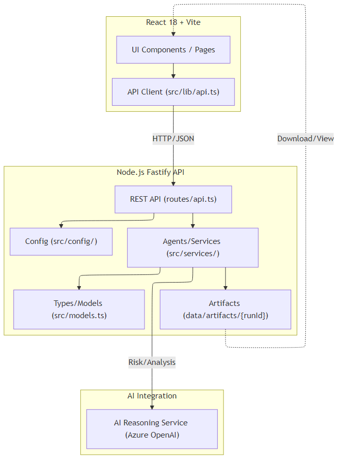
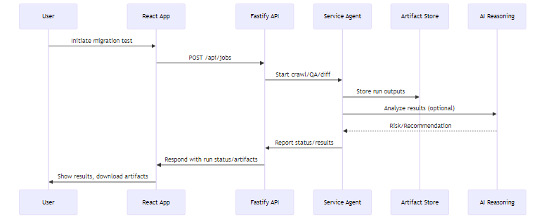
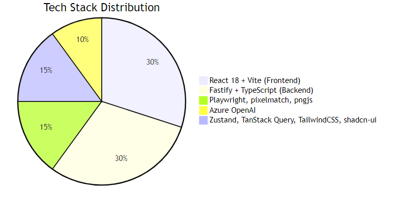

# 🛡️ Migrate Guard – Secure, Automated Website Migration Testing Suite 🚀

> **Supercharge your website migrations:** Spot regressions, catch visual issues, track data and functional differences, and deliver *risk-free* launches—all from one unified platform!

---

<div align="center">
  
  
  
  
  
</div>

---

> 👉 **New here?** Start with the [Developer Onboarding Guide](./DEVELOPERS.md) for setup, API usage, automation, best practices, and everything you need to be productive quickly!

## ✨ What is Migrate Guard?

**Migrate Guard** is an all-in-one automated website migration testing toolkit. It lets engineering/product/QA teams run side-by-side production/candidate comparisons and generate human-friendly reports for Go/No-Go launches and retro analysis.

- **Visual regressions:** Detect pixel diffs, layout shifts, and subtle UI changes
- **Functional QA:** Broken link detection, navigation & forms, JS errors, HAR analysis
- **Data validation:** Compare DOM/text, tables, JSON APIs, and key field mappings
- **AI-powered executive risk analysis:** Severity, risk scores, recommendations (Azure OpenAI!)
- **Super-powered dev workflow:** Snapshots, artifact management, and integrated REST API


## 🗂️ Project Structure

```txt
migrate-guard/
├── backend/          # Node.js Fastify + TypeScript API
│   ├── src/
│   │   ├── routes/   # API routes
│   │   ├── services/ # Comparison, diff, agent, QA, reasoning
│   │   ├── models/   # Strongly typed data models
│   │   └── config/   # Backend config
│   └── data/         # Persisted jobs, runs, artifacts
│   └── README.md     # Backend how-to
├── src/              # React 18 Frontend
│   ├── components/   # UI primitives & dashboard
│   ├── pages/        # Page views
│   ├── lib/          # Types, store, API, utils
│   └── hooks/        # Custom hooks
├── API.md            # Full backend OpenAPI
├── DEVELOPERS.md     # Developer onboarding & conventions
├── README.md         # 👈 You are here!
```


## ⚙️ Tech Stack

**Frontend:** React 18 + Vite + TypeScript · Zustand · TanStack Query · TailwindCSS · shadcn-ui

**Backend:** Fastify · TypeScript · Playwright · pixelmatch · pngjs · Azure OpenAI · File/JSON Storage

## 🎛️ Core Features

- 🤝 **Dual-site diffing**: Compare baseline vs. candidate (prod vs. migration)
- 🖼️ **Visual diffs**: Screenshot, pixel & layout analysis (heatmaps, metrics)
- 🧑‍💻 **Functional QA**: Crawls, forms, broken links, JS errors, HARs
- 📜 **Data Integrity**: Tables, text, APIs—fieldwise diffing
- 🤖 **AI Reasoning**: Severity classification, risk scores, recommendations (Azure/GPT-4)
- 📊 **Automated Reports**: Executive & technical summary, Go/No-Go
- 🗄️ **Artifact Management**: All results, logs, screenshots available for download


--

## 🏗️ API Overview  
Full REST API Docs ➡️ [backend/API.md](./backend/API.md)

**Key Endpoints:**
- `POST /api/jobs` - Create a comparison job
- `POST /api/jobs/:id/run` - Trigger a run
- `GET /api/runs/:id/artifacts` - Fetch run artifacts
- `POST /api/jobs/migrate` - Migrate legacy jobs

Supports:
- 🕸️ Crawl settings: depth, include/exclude
- 🗂️ Page mapping
- 🌐 Test matrix: visual, functional, data, SEO


## 👨‍💻 Quickstart

**Frontend:**
```sh
npm install      # in root
yarn dev         # or npm run dev
# Open http://localhost:8080
```
**Backend:**
```sh
cd backend
npm install
# Install browsers for Playwright crawl agent
npx playwright install chromium
npm run dev      # API at http://localhost:4000/api
```

See [backend/README.md](./backend/README.md) for full setup & CLI options.


## 🧩 Architecture Highlights

### Agents & Services
- **CrawlAgent**: Dual-site crawler, sitemap support, page matcher
- **PlaywrightExecutionService**: Browser/DOM/screenshot/console collector
- **VisualDiffService**: Pixel, layout, and heatmap insight
- **FunctionalQaAgent**: Navigation, forms, links, JS errors, HAR capture
- **DataIntegrityAgent**: Table/text/API comparison, similarity scoring
- **AiReasoningService**: Uses Azure OpenAI for intelligent artifact analysis
- **ReportAgent**: Executive reports, markdown & JSON, Go/No-Go

### Artifact Pipeline
- All artifacts (screenshots, HAR, logs, reports) organized per run in `/backend/data/artifacts/{runId}`
- Executive and technical Markdown reports generated for each run

### Config & Extensibility
- JSON files for jobs/runs -> Plug in DB or cloud storage later
- TODOs in code for Playwright MCP, Crawl4AI, further AI & agent orchestration


---

## 🏁 Phase 2 Roadmap – Comparison Agents & Intelligence

**Full Phase 2 Scope:** 10–14 days dev work · $50–270/month infrastructure (optional) · $1–10/month AI credits

### Phase 2a: Core Comparison (4–5 days, $0 infra) — **RECOMMENDED FIRST**
- [ ] 🖼️ **Visual Diff** (1.5 days) — Pixel-level & layout comparison, heatmaps, severity scoring
- [ ] 🧑‍💻 **Functional QA** (1.5 days) — Form testing, link validation, JS error detection, HAR analysis
- [ ] 📜 **Data Integrity** (1 day) — Table/text/API diffing, field-level similarity scoring
- [ ] 📊 **Basic Report Gen** (0.5 day) — Markdown summaries, artifact links, Go/No-Go criteria

### Phase 2b: AI-Enhanced (+2–3 days, $50–150/month) — **PRIORITY 2**
- [ ] 🤖 **Azure OpenAI Integration** (1.5 days) — Severity classification, business impact, recommendations (~$0.05/run)
- [ ] 📄 **Smart Report Gen** (0.5 day) — LLM-powered insights, false positive filtering, confidence scoring

### Phase 2c: Polish & Analytics (+3–4 days, $0 infra) — **PRIORITY 3**
- [ ] 🧮 **SEO Validation** (0.5 day) — Meta tags, Open Graph, structured data, canonicals
- [ ] ♿ **Accessibility Checks** (0.5 day) — WCAG 2.1 compliance, contrast & heading hierarchy
- [ ] 📈 **Historical Trends** (1.5 days) — Run history, regression detection, trend charts & dashboard
- [ ] 🌐 **Test Matrix Wiring** (0.25 day) — Conditional execution per test type
- [ ] ✅ **E2E Tests & Docs** (1 day) — Validation, examples, troubleshooting

### Future Phases (Phase 3+)
- [ ] 🚧 **Playwright MCP / distributed execution** — Remote worker scaling & multi-machine coordination
- [ ] 🧩 **Pluggable pipeline orchestration** — Agent framework integration for workflow automation
- [ ] 🛡️ **Role-based access control** — Multi-tenant & AuthZ/AuthN for production deployments
- [ ] 🌍 **Production deployment guides** — CI/CD pipelines, secrets management, scaling strategies

### 💰 Cost Breakdown

| Component | Cost | Notes |
|-----------|------|-------|
| File-based storage (current) | $0/mo | JSON snapshots, no DB needed |
| Azure OpenAI API | $1–10/mo | Usage-based; 100 runs = ~$5/mo |
| Optional: Cloud DB (PostgreSQL) | $15–50/mo | Only if scaling >1000 runs/mo |
| Optional: Blob storage (images) | $5–20/mo | Only if cloud-hosting artifacts |
| **Total (lean start)** | **$0–1/mo** | File storage + minimal AI |
| **Total (standard)** | **$50–70/mo** | All features, growth-ready |

---

## 🙏 Contributing & Community

Pull requests and issues are always welcome!

- Please see the internal [backend/README.md](./backend/README.md) for technical contributing guidelines.
- Consider opening an issue, or fork for your own pipelines.
- We love feedback and stars ⭐️!

---

**Migrate Guard** – Secure your migrations, delight your users, and sleep better at night. 🚀🛡️

## 🧪 Testing

- **Backend tests:**
  - Run all backend tests: `cd backend && npm test` (see `backend/tests/` for entry points)
- **Frontend tests:**
  - Add or run tests in `src/pages/` as needed (see project conventions)

## 🧹 Linting & Formatting

- Lint all code: `npm run lint` (uses flat config)
- TypeScript strict mode is enforced throughout the project.

## 🛠️ Extending & Contributing

- Add new agents/services in `backend/src/services/` and models in `backend/src/models/`
- Extend the API in `backend/src/routes/api.ts` using strong schema validation
- Follow conventions in `DEVELOPERS.md` for testability, feature flags, and separation of concerns

## 🤖 AI Configuration

### AI Governance & Disable Mode

Migrate Guard supports two modes of operation:

- **Deterministic mode (AI OFF):** All core validation runs without calling any AI endpoints; deterministic rules, diffs, accessibility, and performance checks are the source of truth. This is the default.
- **AI-assisted mode (AI ON):** AI may be used for semantic summarization, visual interpretation, root-cause suggestions, and report polishing. AI is only an augmentation — deterministic checks remain authoritative.

Controls (in order of precedence):

- Per-run toggle: include `runSettings: { useAI: true|false }` in the run request body to enable AI for that run only.
- Environment variable override: set `ENABLE_AI_REASONING=true` to force-enable AI for runs.
- Global config flag: set `FEATURE_AI_REASONING=true` in the environment or `backend/src/config/config.ts` to enable AI by default.

Default behavior: AI is OFF unless explicitly enabled via one of the controls above. When AI is disabled:

- No calls to AI endpoints are made.
- No prompts are generated or stored.
- Reports are generated using deterministic rule-based logic and raw test outputs.
- Final reports include the label: **"AI disabled — deterministic analysis only"**.

Fallback behavior: If AI is enabled but the endpoint fails or returns invalid data, the runner logs the error, marks AI as degraded for the run, and continues with deterministic analysis. AI results are treated as advisory and must be validated against measured data.

Implementation notes:

- All AI calls are routed through `backend/src/services/aiReasoningService.ts`. Toggle checks are centralized in `AiReasoningService.shouldUseAI()`.
- Environment examples updated: see `backend/.env.example` and `./.env.example` (default: AI OFF).


- Copy the example env file to `backend/.env` and fill in your AI credentials:
  - `backend/.env.example` contains Azure OpenAI and generic OpenAI-compatible variables.
- Azure OpenAI variables (recommended): `AZURE_OPENAI_ENDPOINT`, `AZURE_OPENAI_API_KEY`, `AZURE_OPENAI_DEPLOYMENT_NAME`, `AZURE_OPENAI_API_VERSION`.
- Generic OpenAI-compatible variables (alternative): `AI_BASE_URL`, `AI_API_KEY`, `AI_MODEL`.
- Enable or disable AI features with feature flags in your environment or config (e.g. `FEATURE_AI_REASONING=true`).

Control AI usage:
- Global feature flag: `FEATURE_AI_REASONING=true|false` (in `backend/src/config/config.ts`)
- Env override: `ENABLE_AI_REASONING=true|false` (takes precedence if set)
- Per-run toggle: include `runSettings: { useAI: true|false }` in the `POST /api/jobs/:id/run` body to enable AI for that run only.

Default behavior: AI is OFF unless explicitly enabled via one of the mechanisms above. When AI is disabled, the system uses deterministic, rule-based analysis and labels reports accordingly.

See `backend/.env.example` for a template.

## 📦 Artifacts & Outputs

- All run outputs (screenshots, HAR, logs, reports) are stored under `backend/data/artifacts/{runId}`
- Artifacts are organized per run and available for download via the API

## 🧩 Feature Flags & Test Matrix

- Feature flags and test matrices are used to enable/disable AI, diff, QA, and other features
- Configure these in the relevant config or test files as described in `DEVELOPERS.md`

## 📚 References

- [DEVELOPERS.md](./DEVELOPERS.md): Developer onboarding, conventions, and extending
- [API.md](./API.md): Full backend API documentation
- [.github/copilot-instructions.md](.github/copilot-instructions.md): AI agent and codegen guidance

## 🏗️ Architecture Details

Below are the maintained Mermaid diagrams (also available in `resources/`) to help visualize the system. Click the link to view the raw `.mmd` sources.

### Component Diagram ✅
- Source: `resources/architecture-component-diagram.mmd`



*What's shown:* logical components and their primary relationships (frontend, API router, agents/services, artifacts, and AI reasoning).

### Sequence Diagram ✅
- Source: `resources/architecture-sequence-diagram.mmd`



*What's shown:* high-level interaction flow between user, frontend, API, agents, artifact store, and AI reasoning service.

### Tech Stack (Overview) ✅
- Source: `resources/architecture-tech-stack.mmd`



*What’s shown:* relative weight of the major stacks used in the project (frontend, backend, automation, AI, UI libs).

**Migrate Guard** is structured as a strict TypeScript monorepo with clear backend/frontend separation:

- **Backend (Node.js, Fastify, TypeScript):**
  - Modular "agents" in `backend/src/services/` for crawling, QA, visual diff, data validation, and AI-powered reporting.
  - RESTful API in `backend/src/routes/api.ts` exposes all core operations.
  - Strongly typed models in `backend/src/models.ts`.
  - All persistent data and artifacts (screenshots, HAR, logs, reports) are stored under `backend/data/artifacts/{runId}`.
  - Configurable via files in `backend/src/config/`.
  - Feature flags and test matrices enable/disable AI, diff, QA, etc.

- **Frontend (React 18, Vite, TypeScript):**
  - UI components in `src/components/`, page views in `src/pages/`, and shared types in `src/lib/types.ts`.
  - State management and API logic in `src/lib/store.ts` and `src/lib/api.ts`.
  - Connects to backend API for job/runs management, artifact viewing, and reporting.

- **Extensibility:**
  - Add new agents/services in `backend/src/services/` and extend models in `backend/src/models/`.
  - API endpoints are added in `backend/src/routes/api.ts` with strong schema validation.
  - All config is JSON or TypeScript—no hardcoded values.

- **Data Flow:**
  - Jobs and runs are created via the API, triggering agents to process sites and generate artifacts.
  - Artifacts are stored per run and accessed via the API and frontend dashboard.

- **AI Integration:**
  - `AiReasoningService` uses Azure OpenAI for risk analysis and recommendations.
  - AI features are controlled via feature flags and test matrices.
